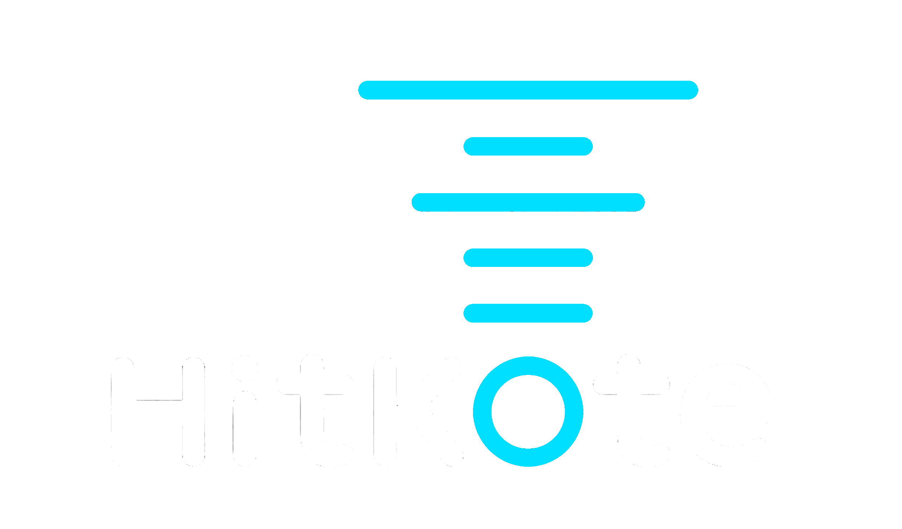

# HITKOTE Fleet Management System

An open-source, vendor-agnostic Fleet Management System (FMS) built on **Eclipse Zenoh** and **VDA 5050 v3.0.0**. Designed to orchestrate heterogeneous fleets of Autonomous Mobile Robots (AMRs) and Automated Guided Vehicles (AGVs) in high-density warehouse and manufacturing environments.

---

## 🛑 The Problem: Vendor Lock-In & Unreliable Wireless Connectivity

Traditional intralogistics relies heavily on proprietary Systems Integrator (SI) platforms and single-vendor hardware ecosystems:
* **Vendor Lock-In:** Integrating AMRs from Manufacturer A with AGVs from Manufacturer B requires costly custom middleware or entirely separate software silos.
* **Wi-Fi TCP Bottlenecks:** Standard MQTT/TCP protocols suffer from Head-of-Line blocking and packet storms when robots roam behind steel pillars or switch Wi-Fi Access Points.
* **Heavy Edge Overhead:** Attempting to control fleet movement using raw, high-frequency internal ROS 2 topics (`/cmd_vel`, `/tf`, `/scan`) over wireless networks wastes bandwidth and computational resources.

---

## 🚀 The HITKOTE Solution

HITKOTE FMS provides a **local-first, open-source orchestration core** that bridges high-level enterprise logistics with low-level robot execution:

1. **VDA 5050 v3.0.0 Native:** Adopts the latest international standard interface for AMRs/AGVs, supporting free navigation, zone-based traffic rules, retriable actions, and path sharing.
2. **Zenoh Transport Layer:** Replaces standard TCP/MQTT with Zenoh (UDP/multicast). Eliminates Wi-Fi drop-out stalls, operates with micro-byte headers, and scales peer-to-peer across warehouse subnets.
3. **Decoupled Architecture:** High-level topological dispatching runs in a high-performance **Rust** core, while a lightweight **C++ ROS 2 Bridge** handles edge translation on the robot.
4. **Fail-Safe Durable State:** Utilizes **Redis** with AOF persistence for active telemetry snapshots, order recovery, and leased TTL spatial traffic locks (3,000 ms) to prevent warehouse deadlocks upon system crashes.
5. **Air-Gapped & Local-First:** Runs 100% locally within warehouse infrastructure via Docker Compose—ideal for strict enterprise security compliance.

---

## 📐 System Architecture

```text
+----------------------------------+   +----------------------------------+
|  WMS / ERP / Enterprise Systems  |   |    Operator GUI / Web Dashboard  |
|  (WES / Fleet Supervisor)        |   |    (Browser Client)              |
+----------------------------------+   +----------------------------------+
                 |                                  |           ^
                 | HTTP POST /tasks                 | HTTP GET  | WebSocket
                 | HTTP POST /orders                | static    | /api/v1/ws
                 +-----------------+----------------+           | (Live Telemetry)
                                   |                            |
                                   v                            |
+---------------------------------------------------------------+-------+
|                         HITKOTE FMS CORE (Rust)                         |
|  - Axum Web Server (REST API, WebSocket Hub, Static File Host @ 8080) |
|  - Tokio Broadcast Engine (`broadcast::channel` Telemetry Fan-out)    |
|  - Petgraph Topological Router (A* / Dijkstra Pathfinding)            |
|  - Dynamic Node & Zone Traffic Reservation Manager                    |
|  - Zenoh Router (`zenoh-rs`)                                          |
+-----------------------------------------------------------------------+
                                   |
                +------------------+------------------+
                |                                     |
                v                                     v
+----------------------------------+ +----------------------------------+
|  REDIS 7 STATE STORE & LOCKS     | |  ZENOH BUS (UDP / Multicast)     |
|  - `hitkote:robot:*` Telemetry     | |  Pattern: `hitkote/v3/{mfr}/{sn}/` |
|  - `hitkote:traffic:*` Leased Locks| |  Payload: VDA 5050 v3.0.0 JSON   |
|  - `hitkote:order:*` Active State  | +----------------------------------+
+----------------------------------+                  |
                                   +------------------+------------------+
                                   |                                     |
                                   v                                     v
                  +---------------------------------+   +---------------------------------+
                  |   HITKOTE ROS 2 BRIDGE (C++ Node) |   |     Non-ROS 2 Legacy AGV Bridge |
                  |   - rclcpp & zenoh-cpp          |   |     - PLC / Modbus / Serial     |
                  |   - Nav2 Action Client          |   |     - VDA 5050 Translator       |
                  +---------------------------------+   +---------------------------------+
                                   |                                     |
                                   v Local ROS 2 IPC                     v Serial / Fieldbus
                  +---------------------------------+   +---------------------------------+
                  |   Modern ROS 2 AMR (Nav2 / SLAM)|   |     Legacy Industrial AGV       |
                  +---------------------------------+   +---------------------------------+
                 
```

---

## 🛠️ Technology Stack

| Layer | Technology | Function |
|---|---|---|
| **FMS Core Engine** | **Rust** (`tokio`, `petgraph`, `serde`) | Task allocation, topological graph routing, node/zone locks |
| **Durable State Store** | **Redis 7** (AOF Enabled) | Telemetry persistence, active order state, leased TTL spatial locks |
| **API & Dashboard Server**| **Axum** (Rust) | REST API for WMS triggers + WebSockets for live 2D UI |
| **Transport Network** | **Eclipse Zenoh** (`zenoh-rs`, `zenoh-cpp`) | Low-latency, loss-resilient pub/sub & queryable transport |
| **Data Protocol** | **VDA 5050 v3.0.0** | Open JSON standard for order control, state, and visualization |
| **Edge Adapter** | **C++** (`rclcpp`, `nlohmann/json`) | Microsecond JSON parsing & ROS 2 Nav2 goal execution |
| **Robot Middleware** | **ROS 2** (Humble / Jazzy) | Onboard SLAM, local costmaps, and motor controller execution |
| **Deployment Target** | **Docker Compose** | Single-command deployment for air-gapped local warehouse servers |

---

## 📁 Repository Directory Layout

```text
hitkote_fms/
├── README.md                  # System overview & technical documentation
├── docker-compose.yml         # Container orchestrator (Redis 7 + HITKOTE Core)
├── .gitignore                 # Root gitignore (Cargo, colcon, CMake, Docker)
│
├── core/                      # FMS SERVER ENGINE (Rust)
│   ├── Dockerfile             # Multi-stage Rust build container
│   ├── Cargo.toml
│   └── src/
│       ├── main.rs            # Entry point & Zenoh session setup
│       ├── api/               # Axum REST endpoints & WebSocket handler
│       ├── fleet/             # Fleet manager & Redis persistence layer
│       ├── router/            # Topological graph routing & zone reservation logic
│       └── vda5050/           # Rust serde structs for VDA 5050 v3.0.0
│
├── adapter/                   # EDGE ROBOT BRIDGES
│   └── hitkote_ros2_bridge/     # C++ ROS 2 package
│       ├── CMakeLists.txt
│       ├── package.xml
│       └── src/
│           └── bridge_node.cpp # Zenoh subscriber <-> Nav2 Action Client bridge
│
├── common/                    # SHARED DATA SPECIFICATIONS
│   └── schemas/               # VDA 5050 v3.0.0 JSON schema validation definitions
│
└── sim/                       # SIMULATION & DEMOS
    └── launch/                # Gazebo environment & multi-robot test launches
```

---

## 🔒 Durable State & Traffic Lock Schema (Redis)

HITKOTE FMS structures state in Redis using a structured key hierarchy:

| Key Pattern | Type | Purpose | Policy |
|---|---|---|---|
| `hitkote:robot:{mfr}:{sn}:state` | JSON | Latest VDA 5050 telemetry snapshot | Persisted (AOF) |
| `hitkote:robot:{mfr}:{sn}:heartbeat` | String | Liveness check | Expires in 5 seconds (`EX 5`) |
| `hitkote:order:{order_id}` | JSON | Active order progress & route nodes | Persisted until completion |
| `hitkote:traffic:node:{node_id}` | String | Exclusive topological node lease | Expires in 3,000 ms (`NX PX 3000`) |
| `hitkote:traffic:edge:{edge_id}` | String | Directional path segment lease | Expires in 3,000 ms (`NX PX 3000`) |

---

## 📡 Zenoh Key-Expression Scheme (VDA 5050 v3.0.0)

HITKOTE FMS organizes network traffic using Zenoh's hierarchical key-expressions:

$$\text{Key Scheme: } \texttt{hitkote/v3/\{manufacturer\}/\{serialNumber\}/\{interface\}}}$$

* **`hitkote/v3/{mfr}/{sn}/order`** *(FMS $\rightarrow$ Robot)*: Assigns topological route nodes, edges, and actions.
* **`hitkote/v3/{mfr}/{sn}/instantActions`** *(FMS $\rightarrow$ Robot)*: Sends high-priority overrides (`pause`, `resume`, `cancelOrder`, `StartHibernation`).
* **`hitkote/v3/{mfr}/{sn}/state`** *(Robot $\rightarrow$ FMS)*: Periodic/event-driven state updates (last node reached, battery, errors, operating mode).
* **`hitkote/v3/{mfr}/{sn}/visualization`** *(Robot $\rightarrow$ FMS)*: High-frequency $(x, y, \theta)$ position streaming for 2D UI rendering.
* **`hitkote/v3/{mfr}/{sn}/factsheet`** *(Robot $\rightarrow$ FMS)*: Static vehicle capability metadata published upon registration.

---

## 🌐 Dual API Specification (Axum Server)

The Axum core runs both REST and WebSockets on port `8080`:

### 1. REST API (For WMS / ERP Integration)
* **`POST /api/v1/orders`** — Submit a new pickup/delivery order.
* **`GET /api/v1/orders/{id}`** — Query order execution status.
* **`GET /api/v1/fleet`** — Fetch current status of all registered AMRs/AGVs.
* **`POST /api/v1/map`** — Upload or update the warehouse topological graph.

### 2. WebSocket API (For Real-Time Dashboard)
* **`WS /ws`** — Bi-directional JSON stream. Pushes live robot positions, zone reservation states, and system alerts to the web dashboard at 1–2 Hz.

---

## ⚡ Getting Started (Quickstart)

### Prerequisites
* Rust (1.80+)
* Docker & Docker Compose
* ROS 2 (Humble or Jazzy)
* C++17 Compiler & CMake

### Running locally via Docker Compose

1. **Clone the Repository:**
   ```bash
   git clone [https://github.com/your-username/hitkote_fms.git](https://github.com/your-username/hitkote_fms.git)
   cd hitkote_fms
   ```

2. **Launch Redis & HITKOTE Core:**
   ```bash
   # For Users
   docker compose up --build

   # For Developers
   RUST_LOG=info cargo run --bin hitkote-core
   ```

3. **Verify Redis & Core Connectivity:**
   ```bash
   # Check Redis container health
   docker exec -it hitkote-redis redis-cli ping
   # Expected output: PONG
   ```

4. **Dispatch a Sample Order via REST:**
   ```bash
   curl -X POST http://localhost:8080/api/v1/orders \
     -H "Content-Type: application/json" \
     -d '{
       "orderId": "ORD_1001",
       "targetNode": "Station_B",
       "requiredCapability": "pallet_transport"
     }'
   ```

5. **Test the ROS2 Adapter:**
   ```bash
   ros2 run hitkote_ros2_bridge bridge_node --ros-args -p agv_id:=amr_01 -p use_sim_time:=true
   ```

6. **Turtlebot4 Simulation:**
   If turtlebot4 simulator is not installed already, run
   ```bash
   sudo apt update
   sudo apt install ros-[your_version]-turtlebot4-simulator
   ```
   If CycloneDDS is not installed, run
   ```bash
   sudo apt install -y ros-[your_version]-rmw-cyclonedds-cpp
   ```
   Add this to .bashrc to use Nvidia GPU:
   ```bash
   export __NV_PRIME_RENDER_OFFLOAD=1
   export __GLX_VENDOR_LIBRARY_NAME=nvidia
   ```

   **Terminal 1: Launch Gazebo Simulation with Robot 1:**
   ```bash
   # 1. Force CycloneDDS and expand participant index range to 500
   export RMW_IMPLEMENTATION=rmw_cyclonedds_cpp
   export CYCLONEDDS_URI='<CycloneDDS><Domain><Discovery><MaxAutoParticipantIndex>500</MaxAutoParticipantIndex></Discovery></Domain></CycloneDDS>'

   # 2. Source ROS 2 setup
   source /opt/ros/jazzy/setup.bash

   # 3. Launch your simulation file
   ros2 launch sim/launch_one.py
   ```

   **Terminal 2: Spawn Robot 2**
   ```bash
   # 1. Force CycloneDDS and expand participant index range to 500
   export RMW_IMPLEMENTATION=rmw_cyclonedds_cpp
   export CYCLONEDDS_URI='<CycloneDDS><Domain><Discovery><MaxAutoParticipantIndex>500</MaxAutoParticipantIndex></Discovery></Domain></CycloneDDS>'

   # 2. Source ROS 2 setup
   source /opt/ros/jazzy/setup.bash

   # 3. Launch your simulation file
   ros2 launch sim/launch_two.py
   ```

   **Terminal 3: Run the adaptor for Robot 1**
   ```bash
   export RMW_IMPLEMENTATION=rmw_cyclonedds_cpp
   export CYCLONEDDS_URI='<CycloneDDS><Domain><Discovery><MaxAutoParticipantIndex>500</MaxAutoParticipantIndex></Discovery></Domain></CycloneDDS>'
   source /opt/ros/jazzy/setup.bash
   source install/local_setup.bash
   ros2 run hitkote_ros2_bridge bridge_node --ros-args   -p agv_id:=amr_01   -p manufacturer:=HITKOTE   -p use_sim_time:=true   -r __ns:=/robot1
   ```

   **Terminal 4: Run the adaptor for Robot 2**
   ```bash
   export RMW_IMPLEMENTATION=rmw_cyclonedds_cpp
   export CYCLONEDDS_URI='<CycloneDDS><Domain><Discovery><MaxAutoParticipantIndex>500</MaxAutoParticipantIndex></Discovery></Domain></CycloneDDS>'
   source /opt/ros/jazzy/setup.bash
   source install/local_setup.bash
   ros2 run hitkote_ros2_bridge bridge_node --ros-args   -p agv_id:=amr_02   -p manufacturer:=HITKOTE   -p use_sim_time:=true   -r __ns:=/robot2
   ```

   **Dispatch an order for Robot 1**
   ```bash
   curl -X POST http://localhost:3000/api/v1/robots/amr_01/orders   -H "Content-Type: application/json"   -d '{
    "robot_id": "amr_01",
    "manufacturer": "HITKOTE",
    "start_node": "ChargingStation",
    "target_node": "WayPoint_A",
    "lock_ttl_secs": 60
   }'
   ```
   **Dispatch an order for Robot 2**
   ```bash
   curl -X POST http://localhost:3000/api/v1/robots/amr_02/orders   -H "Content-Type: application/json"   -d '{
    "robot_id": "amr_02",
    "manufacturer": "HITKOTE",
    "start_node": "WayPoint_A",
    "target_node": "PickZone_1",
    "lock_ttl_secs": 60
   }'
   ```

   **(Useful) Clearn up the dead process**
   ```bash
   # 1. Stop any lingering background nodes
   pkill -9 -f ros2
   pkill -9 -f gz

   # 2. Clear FastDDS shared memory lock files
   rm -rf /dev/shm/fastrtps_*
   ```

---

## 📄 License

Distributed under the Apache 2.0 License. See `LICENSE` for details.